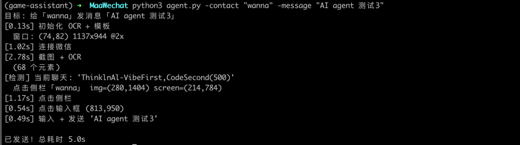

# wxpilot

macOS 微信自动化工具。通过截图 + OCR 识别屏幕内容，模拟鼠标/键盘操作微信客户端。

**纯视觉方案** — 不依赖微信内部 API，不注入进程，不需要越狱/逆向。

## 工作原理

1. 截图微信窗口
2. OpenCV 模板匹配定位图标（搜索框等）
3. RapidOCR 识别文字和位置
4. CGEvent 模拟鼠标点击，osascript 模拟键盘输入

## 依赖

- macOS（使用 CoreGraphics + System Events）
- Python 3.10+

```bash
pip install opencv-python rapidocr_onnxruntime pyobjc-framework-Quartz
```

## 使用

```bash
python3 agent.py -contact "文件传输助手" -message "hello"
```

需要授予终端「辅助功能」和「屏幕录制」权限（系统设置 → 隐私与安全性）。

## 项目结构

```
agent.py    # WeChatAgent 业务逻辑 + 入口
macos.py    # macOS 平台操作（点击、键盘、窗口管理）
vision.py   # 截图 + 模板匹配 + OCR 识别
resource/   # 模板图片
```

## 效果图


